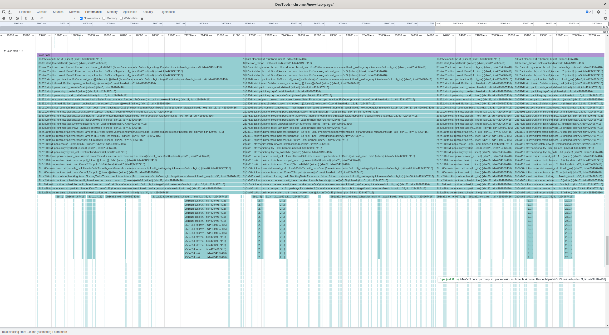
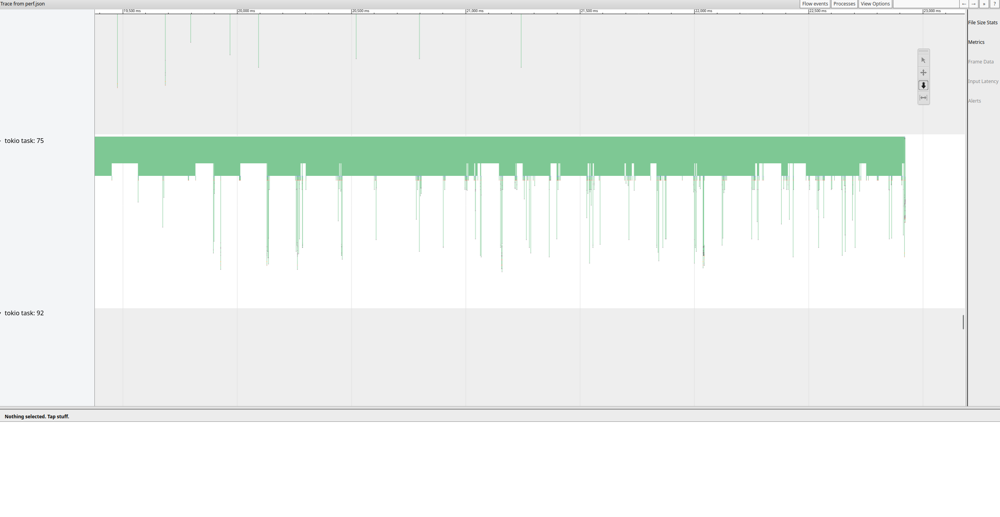

# Tokio2Chrome
A small tool to convert [tokio] tracing data captured by [perf] to the Google [Trace Event Format] that can be read
using [Google Chrome] / [Chromium] or [Speedscope].


## Why
Linux [perf] is a very powerful tool to understand the performance of an app. While it knows about threads, the [tokio]
tasks are completely opaque to it and hence you'll have a hard time reading the `perf script` output. The tooling in
this repo wants to help with this.


## Technical Background
Ideally this would work without modifying the source code and just by using dynamic tracepoints. Seems
[we cannot have nice things](https://lore.kernel.org/linux-perf-users/YboC1QIP342BBz5t@kernel.org/) though. I unable to
use `perf probe` to insert tracepoints at the right places, because `perf` did neither accept the demangled Rust
symbols nor the mangled ones.

So have modified [tokio] to include [SystemTap SDT] probes and provide some tooling to process these.

Here are two example outputs:





## Usage

### Test App
We will use a modified version of [InfluxDB IOx]. Start by creating a clean directory:

```console
$ mkdir src
$ cd src
```

Get [patched version of tokio](https://github.com/crepererum/tokio/tree/crepererum/probes):

```console
$ git clone -b crepererum/probes https://github.com/crepererum/tokio.git
```

Get [patched version of InfluxDB IOx](https://github.com/influxdata/influxdb_iox/tree/crepererum/probes):

```console
$ git clone -b crepererum/probes https://github.com/influxdata/influxdb_iox.git
```

Build the app:

```console
$ cargo build --profile=quick-release
```

Finally, register the app tracepoints:

```console
$ sudo ./setup_iox.sh
```

### User Config (optional)
To improve `perf` output, run:

```console
$ ./setup_user.sh
```

### System Setup
You won't have the permissions to just run `perf record`, so we need to weaken the system a bit:

**IMPORTANT: Run this AFTER `setup_iox.sh`!**

```console
$ sudo ./setup_system.sh
```

(sometimes this will fail on the first run, just run it a second time)

### Record

```console
$ ./record.sh target/quick-release/influxdb_iox all-in-one ...
```

### Analyze
First convert the binary output (`perf.data`) to text dump (`perf.txt`):

```console
$ perf script > perf.txt
```

Then convert it to a [JSON]:

```console
$ ./script2chrome.py
```

You can load the resulting `perf.json` into [Google Chrome] / [Chromium] or [Speedscope].

You can also use [Catapult] to convert `perf.json` into an HTML:

```console
$ path/to/catapult/tracing/bin/trace2html perf.json --output=perf.html --config full
```


## License

Licensed under either of these:

 * Apache License, Version 2.0 ([LICENSE-APACHE](LICENSE-APACHE) or <https://www.apache.org/licenses/LICENSE-2.0>)
 * MIT License ([LICENSE-MIT](LICENSE-MIT) or <https://opensource.org/licenses/MIT>)


### Contributing

Unless you explicitly state otherwise, any contribution you intentionally submit for inclusion in the work, as defined
in the Apache-2.0 license, shall be dual-licensed as above, without any additional terms or conditions.


[Catapult]: https://github.com/catapult-project/catapult
[Chromium]: https://www.chromium.org/Home/
[Google Chrome]: https://www.google.com/chrome/index.html
[InfluxDB IOx]: https://github.com/influxdata/influxdb_iox/
[JSON]: https://www.json.org/
[perf]: https://perf.wiki.kernel.org/index.php/Main_Page
[Speedscope]: https://www.speedscope.app/
[SystemTap SDT]: https://sourceware.org/systemtap/wiki/AddingUserSpaceProbingToApps
[tokio]: https://tokio.rs/
[Trace Event Format]: https://docs.google.com/document/d/1CvAClvFfyA5R-PhYUmn5OOQtYMH4h6I0nSsKchNAySU/preview
